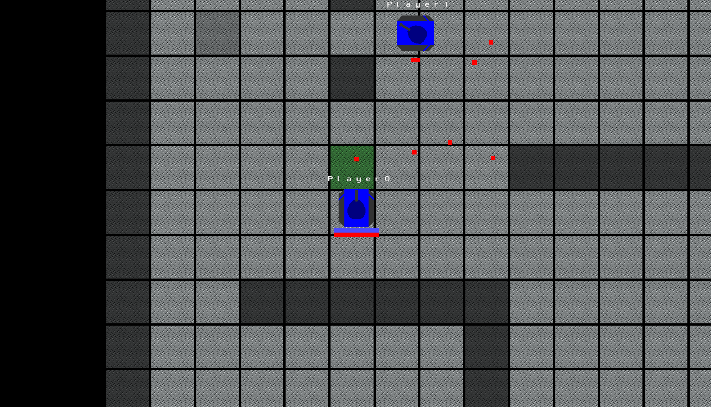
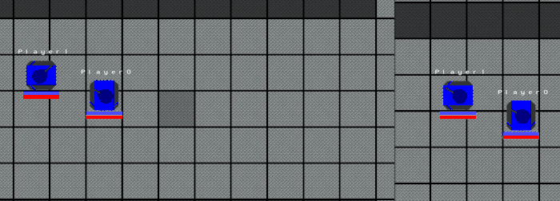
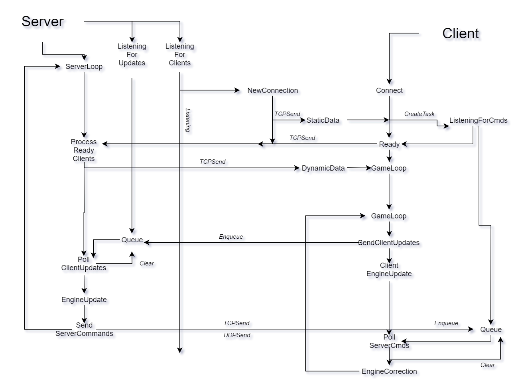

# TANK GAME
Implemented as the final project for Advanced C# .NET Course.

Multiplayer 2D free-for-all PVP game written in C# consisting of a dedicated server program
and a client application. Player controls a tank with the sole objective of destroying
other players, there is not time limit and unlimited ammo, on death the player is respawned at random location.

I chose this topic to demonstrate my knowledge of asynchronous, multithreaded, task-based programming and networking in C#, as well as practice with OpenGL.

Technologies and concepts used:
- [OpenTK](https://github.com/opentk/opentk) library for graphics,
- TCP/UDP asynchronous communication,
- Server-side physic distributed using Command pattern to clients,
- Client-side prediction for smooth movement.
- Artificial latency and packet loss to demonstrate the above locally.
- Multiple assemblies, shared engine.

# Quickstart
1. Open the solution file `TankGame.sln` in Visual Studio (tested 2017,2019).
2. Compile it, all compiled files are put in `bin/` folder.
3. Start `bin/{Release,Debug}/Server/Server.exe`
4. Start `bin/{Release,Debug}/Server/Client.exe`
5. Enter the IP address of the computer at which the server is running - `127.0.0.1` if started locally.
6. Enjoy the game.

##Controls
- `WASD` for moving,
- left mouse button to shoot,
- `TAB` to see the score.

## Artificial latency and packet loss

- Tweak the constants in `Server/ClientsManager.class:31,34` class.
- Player1 sees Player0 with a delay.
- Both see only some bullets that were fired since some "firing" packets got lost.

The code should be sufficiently documented in English but the full documentation(`dokumentace/main.pdf`) is only in Czech.

## Interaction between the Server's and Client's loops

